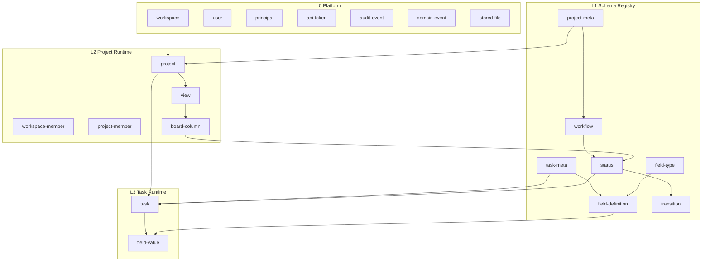

# open-teambition Data Model

> 领域模型的拆分、实体关系与关键设计决策。
> 状态：**草案（待评审）**。
>
> 相关文档：[tech-stack.md](./tech-stack.md) · [permission-model.md](./permission-model.md)

## 1. Design Principles

### 1.1 Schema Layer vs Runtime Layer

采用 **「Schema 定义能力，Runtime 存储数据」** 的双层结构：

| 层 | 职责 | 核心模型 |
|---|---|---|
| **元数据层（Schema）** | 定义「能有什么、怎么流转、有哪些字段」 | `project-meta`, `task-meta`, `field-type`, `field-definition`, `workflow`, `status`, `transition` |
| **实例层（Runtime）** | 存储真实业务数据 | `workspace`, `project`, `task`, `field-value` |

类比：Jira Issue Type Scheme、Salesforce Object Metadata、Teambition 项目模板。

### 1.2 Field-Driven: Everything Is a Field

业务语义优先表达为 **字段类型（field-type）**，而非每种语义单独建业务表。

以下概念均为 `field-type`，不是独立领域实体：

- `tag` — 标签
- `attachment` — 附件
- `sprint` — 迭代

新增业务能力 = 注册新 field-type，无需改表结构。

### 1.3 Field Three-Tier Model

```
field-type（类型能力注册）
    ↓
field-definition（在 project-meta / task-meta 上声明）
    ↓
field-value（挂在 project / task 实例上的值）
```

| 概念 | 说明 |
|---|---|
| `field-type` | 类型注册表：定义值结构、配置结构、校验与查询能力 |
| `field-definition` | 在某类 project / task 上声明字段：key、类型、必填、选项等 |
| `field-value` | 具体实例上的字段值 |

> 在权限模型中，`field-definition` 对应 `custom_fields` 表，`field-value` 对应 `custom_field_values` 表。详见 [permission-model.md](./permission-model.md)。

---

## 2. Layered Architecture



### Layer Responsibilities

| 层 | 模块 | 说明 |
|---|---|---|
| **L0 Platform** | `platform/` | 多租户、身份、审计、事件、文件存储；与业务 schema 无关 |
| **L1 Schema Registry** | `schema/` | 可版本化、可模板化；支持项目模板 |
| **L2 Project Runtime** | `project/` | project 实例、成员、视图配置 |
| **L3 Task Runtime** | `task/` | task 实例、字段值 |

---

## 3. Model Inventory

### 3.1 L0 Platform

| 模型 | 说明 | MVP |
|---|---|---|
| `workspace` | 工作空间（租户边界） | 是 |
| `user` | 用户 | 是 |
| `principal` | 统一主体：`user` \| `agent` \| `service` | 是 |
| `api-token` | PAT，带 scope 限制 | 是 |
| `audit-event` | 写操作审计：who / what / when / before / after | 是 |
| `domain-event` | 领域事件，驱动 `LISTEN/NOTIFY` + Agent live query | 是 |
| `stored-file` | 对象存储元数据（bucket key、hash、size、上传者） | 是 |

> `stored-file` 是存储基础设施，不是 task 的子业务实体。task 通过 `field-value(type=attachment)` 引用 `fileId`。

### 3.2 L1 Schema Registry

| 模型 | 说明 | MVP |
|---|---|---|
| `project-meta` | 项目模板：类型、默认工作流、支持的 task-meta、项目级字段 | 是 |
| `task-meta` | 任务类型定义：名称、图标、关联的 field-definition | 是 |
| `field-type` | 字段类型注册表（见第 4 节） | 是 |
| `field-definition` | 字段 schema：key、类型、配置、必填、默认值 | 是 |
| `workflow` | 工作流定义 | 是 |
| `status` | 状态节点：名称、顺序、颜色、是否终态 | 是 |
| `transition` | 状态流转边：from → to | 是 |
| `transition-rule` | 流转约束：权限、前置条件、必填字段、自动化 | 二期 |

### 3.3 L2 Project Runtime

| 模型 | 说明 | MVP |
|---|---|---|
| `project` | 项目实例 | 是 |
| `workspace-member` | 工作空间成员 | 是 |
| `project-member` | 项目成员（可覆盖 workspace 默认权限） | 是 |
| `role` | 角色定义 | 是（极简） |
| `permission` | 能力粒度权限 | 是 |
| `view` | 视图配置：看板 / 列表 / 日历 | 是（至少 kanban） |
| `board-column` | 看板列与 status 的映射 | 是 |
| `invitation` | 邀请入 workspace / project | 二期 |

### 3.4 L3 Task Runtime

| 模型 | 说明 | MVP |
|---|---|---|
| `task` | 任务实例（含内置列，见第 5 节） | 是 |
| `field-value` | 任务 / 项目实例上的字段值 | 是 |

### 3.5 Models That Stay Independent (Not Fields)

| 模型 | 不作为 field 的原因 | 阶段 |
|---|---|---|
| `workflow` / `status` / `transition` | 状态机是横切规则，不是普通属性值 | MVP |
| `comment` | 时序流、富文本、@提及，语义不同于 field-value | 二期 |
| `task-relation` | 图结构查询（阻塞链）频繁；后期可用 `field-type: relation` 统一 | 二期 |
| `view` / `board-column` | UI 配置，不是业务属性 | MVP |
| `notification` | 推送通道，横切关注点 | 二期 |

---

## 4. Field Type System

### 4.1 Type Catalog

| 类别 | field-type | 说明 | value 形态 |
|---|---|---|---|
| 基础 | `text`, `number`, `date`, `datetime`, `boolean` | 标量 | 单值 |
| 选择 | `select`, `multi-select` | 单选 / 多选 | option id / id[] |
| 人员 | `user`, `user-list` | 负责人、参与者 | user id / id[] |
| 标签 | `tag` | 标签 | string[] 或 option id[] |
| 附件 | `attachment` | 文件 | file-ref[] |
| 迭代 | `sprint` | 所属迭代 | sprint-ref（见 4.5） |
| 关系 | `relation` | 父子任务、关联任务 | task-id / task-id[] |
| 状态 | `status` | 工作流状态 | status-id（存储见第 5 节） |

### 4.2 Field Type Registry

```ts
interface FieldType {
  key: string;
  label: string;
  valueSchema: ZodSchema;
  configSchema: ZodSchema;
  scopes: ("project" | "task")[];

  capabilities?: {
    validate?: (def, value, ctx) => void;
    onChange?: (def, oldVal, newVal, ctx) => DomainEvent[];
    queryable?: boolean;
  };
}
```

每个 `field-definition` 可配置 `read_point` / `write_point` 权限点（为空则回退实体级权限），详见 [permission-model.md §7](./permission-model.md#7-field-level-authorization)。

### 4.3 tag

不需要独立 `tag` 表。

```ts
// field-definition
{
  key: "labels",
  type: "tag",
  config: {
    vocabulary: "project",
    allowCreate: true,
    colorMap: { ... }
  }
}

// field-value
{ value: ["bug", "p0", "backend"] }
```

### 4.4 attachment

不需要独立 `attachment` 表。

```ts
// field-definition
{
  key: "files",
  type: "attachment",
  config: {
    maxCount: 10,
    maxSizeMb: 50,
    allowedMime: ["image/*", "application/pdf"]
  }
}

// field-value
{
  value: [
    { fileId: "f_01", name: "spec.pdf", mime: "application/pdf", size: 102400 }
  ]
}
```

底层通过 `stored-file` 管理对象存储，task 只持有引用。

### 4.5 sprint

不需要独立 `sprint` 表，也不需要内置列（见第 5 节）。

**项目级：迭代目录（catalog 模式）**

```ts
// field-definition（scope: project）
{
  key: "sprints",
  type: "sprint",
  config: { mode: "catalog" }
}

// field-value（挂在 project 上）
{
  value: [
    { id: "sp_1", name: "Sprint 1", start: "2026-07-01", end: "2026-07-14" },
    { id: "sp_2", name: "Sprint 2", start: "2026-07-15", end: "2026-07-28" }
  ]
}
```

**任务级：迭代归属（ref 模式）**

```ts
// field-definition（scope: task）
{
  key: "sprint",
  type: "sprint",
  config: {
    mode: "ref",
    catalogField: "sprints",
    nullable: true
  }
}

// field-value（挂在 task 上）
{ value: "sp_1" }   // 或 null（backlog）
```

---

## 5. Built-in Columns vs Field Types

### 5.1 Criteria

内置列适合同时满足以下条件的属性：

1. 每个任务几乎都有
2. 所有项目类型都需要
3. 有独立领域规则（如状态机）
4. 高频变更 + 高频查询
5. 全产品语义唯一

### 5.2 Comparison Table

| 属性 | 存储方式 | 理由 |
|---|---|---|
| `title` | 内置列 `task.title` | 每个任务必有，高频查询 |
| `status` | 内置列 `task.status_id` + 语义上是 field | 工作流核心，看板拖拽高频读写 |
| `assignee` | 内置列 `task.assignee_id`（MVP 单人） | 高频筛选；后期可扩展为 field-type `user-list` |
| `due_date` | 内置列 `task.due_date` | 高频筛选 / 排序；Agent 逾期触发依赖 |
| `created_at` / `updated_at` | 内置列 | 系统字段 |
| `deleted_at` | 内置列 | 软删除 |
| `tag` | field-type | 非所有项目必需，语义可多个 |
| `attachment` | field-type | 非所有任务有附件 |
| `sprint` | field-type | 仅敏捷项目使用；可能有 release / milestone 等其他迭代维度 |
| 其他自定义属性 | field-type + field-value | 由 field-definition 驱动 |

### 5.3 status Hybrid Approach

`status` 采用 **语义 field + 存储内置列**：

- 对外：可通过 `field-definition` 声明为 `field-type: status`
- 对内：`task.status_id` 冗余存储，工作流引擎直接读写
- 避免看板拖拽每次 join `field-value` 表

`sprint` **不采用**混合方案，避免 `field-value` 与内置列双写不一致。

---

## 6. Key Relationships

### 6.1 project-meta Structure

`project-meta` 是模板，不应承载为单一 JSON blob：

```
project-meta
  ├── task-meta[]              # 本项目支持的任务类型
  ├── workflow                 # 默认工作流
  ├── field-definition[]       # 项目级自定义字段
  └── default-view             # 默认视图配置
```

### 6.2 Template Snapshot

- `project-meta` 是**可复用模板**
- 创建 `project` 时，从 `project-meta` **快照复制**配置到项目级
- 修改模板**不影响**已建 project

### 6.3 task-meta and field-definition

多对多关系，通过 `task-meta-field-binding` 关联（可 per-type 覆盖必填、默认值、可见性）。

### 6.4 Workflow Scope

| 方案 | 适用阶段 |
|---|---|
| workflow 挂在 project-meta / project | MVP 推荐 |
| workflow 挂在 task-meta | 不同类型不同流转 |
| 两者兼有 | 完整产品阶段 |

MVP：**project 级一个 workflow**；`task-meta` 只决定字段 schema。

### 6.5 Membership and Authorization

```
workspace
  └── workspace-member (user + role)
        └── project
              └── project-member (可覆盖 role)
```

人与 Agent 统一为 `principal`，通过 `api-token` + scope 鉴权。

资源树与权限判定详见 [permission-model.md](./permission-model.md)。资源层级为 `workspace → project → task`，每个领域实体与 `resources` 表共享主键。

---

## 7. field-value Storage Strategy

### 7.1 Hybrid Storage (MVP)

| 数据 | 存储 |
|---|---|
| 内置属性 | `task` 表列 |
| 自定义属性 | `field-value` 表 |

### 7.2 Suggested Table Structure

```sql
field_value (
  id            TEXT PRIMARY KEY,      -- ULID
  entity_type   TEXT NOT NULL,         -- 'project' | 'task'
  entity_id     TEXT NOT NULL,
  project_id    TEXT NOT NULL,
  field_key     TEXT NOT NULL,
  value_text    TEXT,                  -- 索引友好列
  value_json    JSONB,
  UNIQUE (entity_type, entity_id, field_key)
);
```

### 7.3 Index Example

```sql
CREATE INDEX idx_field_value_sprint
  ON field_value (project_id, field_key, value_text)
  WHERE field_key = 'sprint';
```

---

## 8. Key Design Decisions

| # | 决策 | 结论 | 理由 |
|---|---|---|---|
| 1 | 模板快照 | 创建 project 时快照，改模板不影响已有项目 | 生产稳定性 |
| 2 | 工作流粒度 | MVP project 级 | 降低复杂度 |
| 3 | 字段存储 | 内置列 + field-value 行存 | 平衡性能与扩展性 |
| 4 | 软删除 | 全局 `deleted_at` | 协作工具标配 |
| 5 | ID 策略 | ULID | 时间有序，Agent / 分布式友好 |
| 6 | attachment / tag / sprint | 均为 field-type | 统一扩展模型 |
| 7 | sprint 内置列 | 不做 | 非通用属性，可能有多种迭代维度 |
| 8 | status 内置列 | 做 | 工作流核心，高频读写 |

---

## 9. MVP Model Set

共 20 个模型：

```
Platform (7):  workspace, user, principal, api-token, audit-event, domain-event, stored-file
Schema (7):    project-meta, task-meta, field-type, field-definition, workflow, status, transition
Project (5):   project, workspace-member, project-member, view, board-column
Task (2):      task, field-value
```

MVP field-type：

```
text, number, date, select, user, tag, attachment, sprint, status
```

Phase 2：

```
transition-rule, comment, task-relation, notification, invitation, relation
```

---

## 10. Code Module Layout

对应 [tech-stack.md](./tech-stack.md) 中的 monorepo 规划：

```
packages/core/src/domain/
  platform/       # workspace, user, principal, token, audit, event, stored-file
  schema/         # project-meta, task-meta, field-*, workflow, status, transition
  project/        # project, member, view, board-column
  task/           # task, field-value
  capability/     # Capability Registry

packages/shared/
  schemas/        # Zod schema，与 Drizzle table 按聚合根对应
```

---

## 11. Entity Relationship Diagram

```mermaid
erDiagram
    workspace ||--o{ project : contains
    workspace ||--o{ workspace-member : has
    user ||--o| principal : is
    principal ||--o{ api-token : owns

    project-meta ||--o{ project : templates
    project-meta ||--o{ task-meta : defines
    project-meta ||--o| workflow : default

    workflow ||--o{ status : contains
    status ||--o{ transition : from
    status ||--o{ transition : to

    task-meta ||--o{ field-definition : binds
    field-type ||--o{ field-definition : types

    project ||--o{ task : contains
    project ||--o{ project-member : has
    project ||--o{ view : has
    project ||--o{ field-value : "project fields"

    task-meta ||--o{ task : types
    status ||--o{ task : "status_id"
    task ||--o{ field-value : "task fields"

    view ||--o{ board-column : has
    status ||--o{ board-column : maps

    task ||--o{ audit-event : generates
    task ||--o{ domain-event : emits
```

---

## 12. Open Questions

1. **assignee 单人 vs 多人**：MVP 内置列单人，还是直接用 `field-type: user-list`？
2. **field-value 行存 vs JSONB 列**：是否在 `task` 上额外加 `custom_fields JSONB` 作为读优化？
3. **comment 二期模型**：独立表 vs 时序 field-type？
4. **project-meta 版本化**：是否需要显式版本号，支持模板升级 diff？

---

## Changelog

| Date | Change |
|---|---|
| 2026-07-16 | 初稿：meta/instance 分层、field 体系、内置列策略 |
| 2026-07-19 | 重命名为 `data-model.md`，对齐权限模型术语 |
